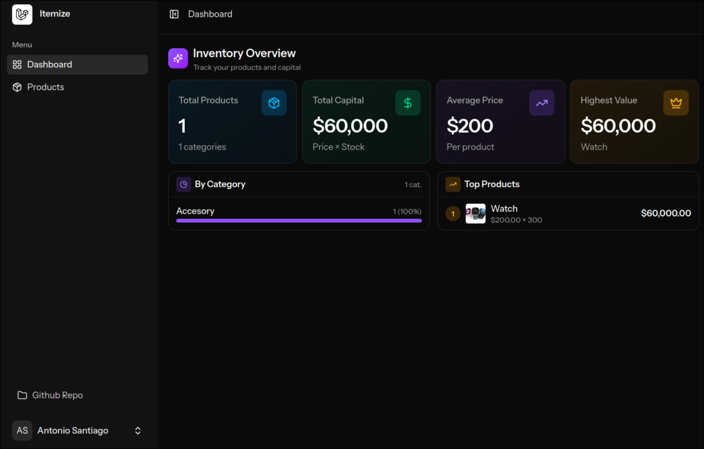
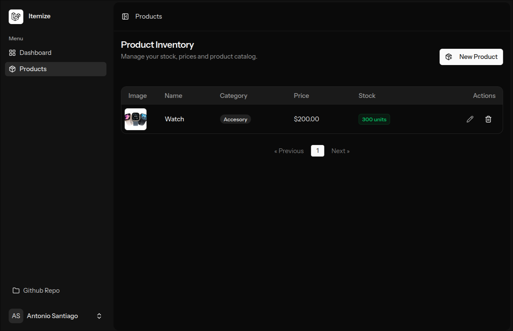
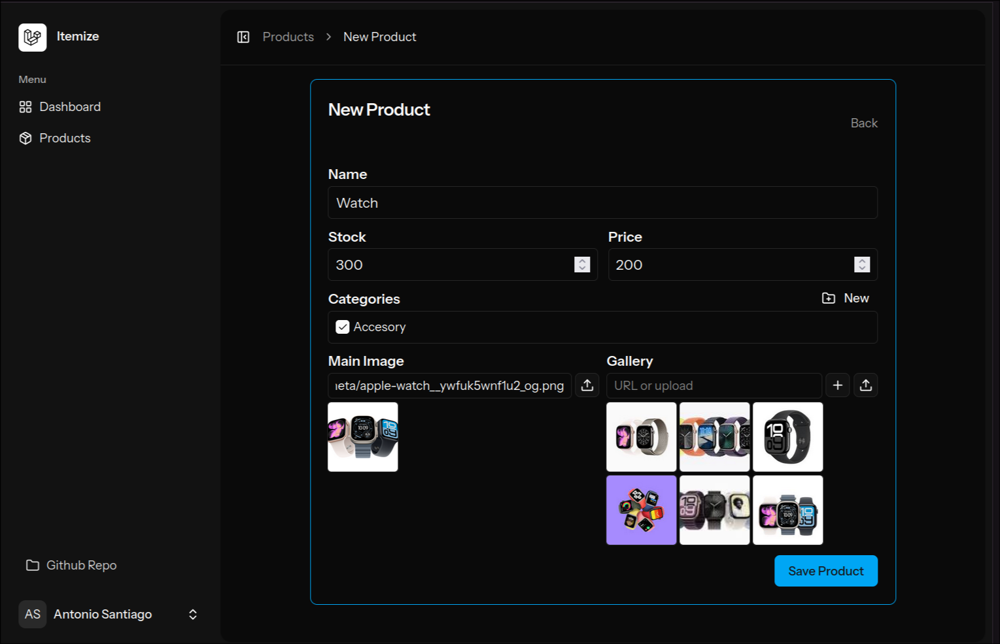
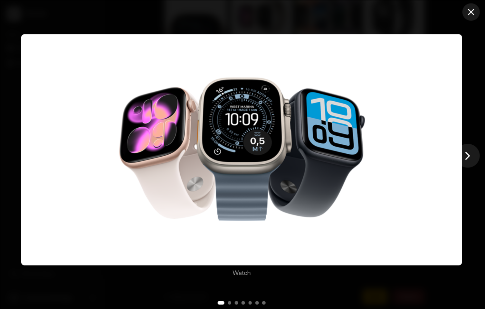

<div align="center">

# Itemize

**A lightweight Laravel + Inertia + Vue starter for product catalogs and item management**

<!-- Badges -->
<p align="center">
  <a href="https://www.php.net/"></a>
  <a href="https://laravel.com/"></a>
  <a href="https://nodejs.org/"></a>
  <a href="https://vitejs.dev/"></a>
  <a href="https://www.postgresql.org/"></a>
  <a href="LICENSE"></a>
</p>

<p align="center">
  � <b>Live Demo deployed on DigitalOcean (Traefik Gateway + Docker Compose)</b>
</p>

</div>

---

## 🖥️ Live Demo

Live URL here:

```
https://itemize.tonys-dev.com
```

---

## Screenshots

<p align="center">
  
  <br>
  
  <br>
  
  <br>
  
</p>

---

## ✅ Overview

Itemize is a Laravel (PHP) application using Inertia + Vue 3 and Vite for frontend, designed as a starter for product/catalog management (products, categories, image uploads). It includes authentication (Fortify), API-friendly controllers, Cloudinary integration for media, and developer tooling for fast local and Docker-based development.

Why this project exists: to provide a modern full-stack starter with server-driven UIs (Inertia), TypeScript/Vue for frontend, and an easy Docker development flow.

---

## 🛠️ Tech Stack

Frontend
- Vue 3 (resources/js) — vue ^3.5
- Inertia (Inertia + @inertiajs/vue3)
- Vite for bundling (vite ^7)
- TypeScript (tsconfig.json)
- TailwindCSS (tailwindcss ^4)

Backend
- PHP ^8.2 (composer.json)
- Laravel ^12
- Laravel Fortify (authentication)
- Sanctum (API authentication)
- Cloudinary PHP SDK (cloudinary/cloudinary_php)

Database & Infrastructure
- Development DB: SQLite (default `.env.example`), Docker Compose uses Postgres 15 (docker-compose.yml)
- Docker & Docker Compose (Dockerfile + docker-compose.yml)

Testing & Quality
- Pest / PHPUnit for tests (pestphp/pest)
- Laravel Pint (PHP linter/formatter)
- ESLint + Prettier for JS/TS

DevOps & Deployment
- Dockerfile, docker-compose.yml
- Vite SSR support (vite.config.ts)

---

## 📁 Project structure (top-level)

```
Itemize/
├─ app/                    # Laravel app code (Models, Controllers, Services)
├─ bootstrap/
├─ config/
├─ database/               # migrations, factories, seeders
├─ public/                 # web root
├─ resources/              # js, css, views (Inertia pages)
├─ routes/                 # web.php, api.php, settings.php
├─ storage/
├─ tests/                  # Pest / PHPUnit tests
├─ Dockerfile
├─ docker-compose.yml
├─ composer.json
├─ package.json
└─ vite.config.ts
```

See `app/`, `resources/js/`, `routes/web.php` for the main application flow (server-driven pages and product/category controllers).

---

## 🚀 Getting Started

This project supports two development flows: Docker-first (recommended) and local (native PHP + Node).

### Prerequisites
- Docker & Docker Compose (for Docker flow)
- OR: PHP >= 8.2, Composer, Node.js (18+), npm
- Git
- Optional: Cloudinary account (if using Cloudinary image uploads)

Minimum versions (recommended):
- PHP: 8.2+
- Node: 18+
- Composer: 2+
- Docker: 20+, Docker Compose v2+

### Quickstart — Docker (recommended)
1. Copy/create .env values (or set env vars for docker-compose):

```bash
# set these environment variables in your shell, or create a .env file next to docker-compose.yml
export DB_DATABASE=itemize_db
export DB_USERNAME=itemize_user
export DB_PASSWORD=changeme
```

2. Build and start services:

```bash
docker-compose up --build
```

- The `app` service runs `composer run dev` by default (see `docker-compose.yml`) so Artisan, queue listener, pail, and Vite are started concurrently.
- Ports: host:8000 → app (Laravel), host:5173 → Vite, host:5432 → Postgres

3. Enter the `app` container if needed:

```bash
docker-compose exec app bash
# then you can run artisan/composer commands, e.g.
php artisan migrate --force
```

### Local development (without Docker)
1. Install PHP dependencies

```bash
composer install
```

2. Install Node dependencies

```bash
npm install
```

3. Copy .env

```bash
cp .env.example .env
php artisan key:generate
```

4. Run migrations and build assets

```bash
php artisan migrate
npm run dev   # starts Vite dev server
```

5. Start Laravel

```bash
# Option A: run concurrently with composer script
composer run dev
# Option B: start artisan only
php artisan serve --host=0.0.0.0 --port=8000
```

---

## 🧩 Environment variables

Important variables used by the project (see `.env.example` and `docker-compose.yml`):

Required (minimum to run):
- APP_URL (e.g. http://localhost:8000)
- DB_CONNECTION (sqlite or pgsql)
- DB_HOST (when using Postgres)
- DB_PORT
- DB_DATABASE
- DB_USERNAME
- DB_PASSWORD

Optional / Integration
- AWS_ACCESS_KEY_ID, AWS_SECRET_ACCESS_KEY, AWS_BUCKET (if using S3)
- CLOUDINARY_URL or Cloudinary-specific vars (if using Cloudinary)
- MAIL_* (mail settings)
- VITE_APP_NAME

Note: `.env.example` defaults to SQLite for local dev, while `docker-compose.yml` sets DB_CONNECTION=pgsql and expects DB_DATABASE/DB_USERNAME/DB_PASSWORD to be provided as environment variables.

---

## ⚙️ Available Scripts & Commands

From package.json (frontend):
- npm run dev            # start Vite dev server
- npm run build          # production build (vite build)
- npm run build:ssr      # build + SSR
- npm run lint           # eslint
- npm run format         # prettier format

From composer.json (backend / orchestrators):
- composer run setup     # install deps, copy .env, key:generate, migrate, npm install, npm run build
- composer run dev       # start server, queue, pail, vite concurrently (dev mode)
- composer run dev:ssr   # build:ssr + run server + inertia:ssr
- composer run lint      # pint (PHP formatting)
- composer run test      # runs php artisan test (Pest/PHPUnit)

Docker
- docker-compose up --build
- docker-compose exec app bash

Testing
- composer run test
- php artisan test

---

## ✨ Features

- Authentication (Laravel Fortify)
- Product management (CRUD) — routes defined with resource controller `products` (see `routes/web.php`)
- Category management (AJAX-friendly JSON endpoints)
- Image uploads (ImageController + Cloudinary integration)
- Inertia + Vue frontend pages (server-driven SPA)
- Dev tooling: Vite, Tailwind, ESLint, Prettier, Pint, Pest

---

## 📚 Quick API / Routes (high-level)

Main web routes (see `routes/web.php`):
- GET /                           → Welcome page (Inertia)
- GET /dashboard                  → Dashboard (auth)
- Resource routes for /products   → ProductController (index, show, create, store, update, destroy)
- POST /categories                → CategoryController@store
- PUT /categories/{category}      → CategoryController@update
- DELETE /categories/{category}   → CategoryController@destroy
- POST /images/upload             → ImageController@store

For full API docs, check `routes/api.php` and inspect controllers in `app/Http/Controllers`.

---

## ✅ Testing

Run the test suite (Pest / PHPUnit):

```bash
composer run test
# or
php artisan test
```

The `phpunit.xml` config sets testing env vars (uses sqlite in-memory by default):
- DB_CONNECTION=sqlite
- DB_DATABASE=:memory:

---

## 📦 Deployment

Production build steps (general guidance):
1. Build frontend assets:

```bash
npm ci
npm run build
```

2. Prepare the server (PHP 8.2+, Composer), set production `.env` vars and run migrations:

```bash
composer install --no-dev --optimize-autoloader
php artisan migrate --force
php artisan config:cache
php artisan route:cache
```

3. Use a process manager (supervisor/systemd) to run queue workers (php artisan queue:work) and a webserver (nginx + php-fpm). Or deploy with Docker using `docker-compose` / Kubernetes.

---

## 🤝 Contributing

Contributions are welcome!
- Create a branch with a descriptive name
- Run tests and linters before opening a PR
- Keep changes small and focused

Suggested checks locally:

```bash
npm run lint
composer run lint
composer run test
```

---

## 📝 License

This project is licensed under the MIT License — see `LICENSE`.

---

## 👤 Author / Contact

- Antonio Santiago (TonyS-dev)
- GitHub: https://github.com/TonyS-dev
- Email: santiagor.acarlos@gmail.com
